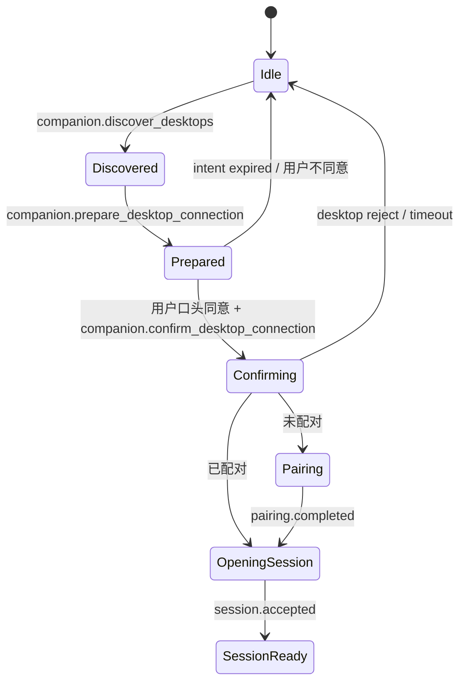
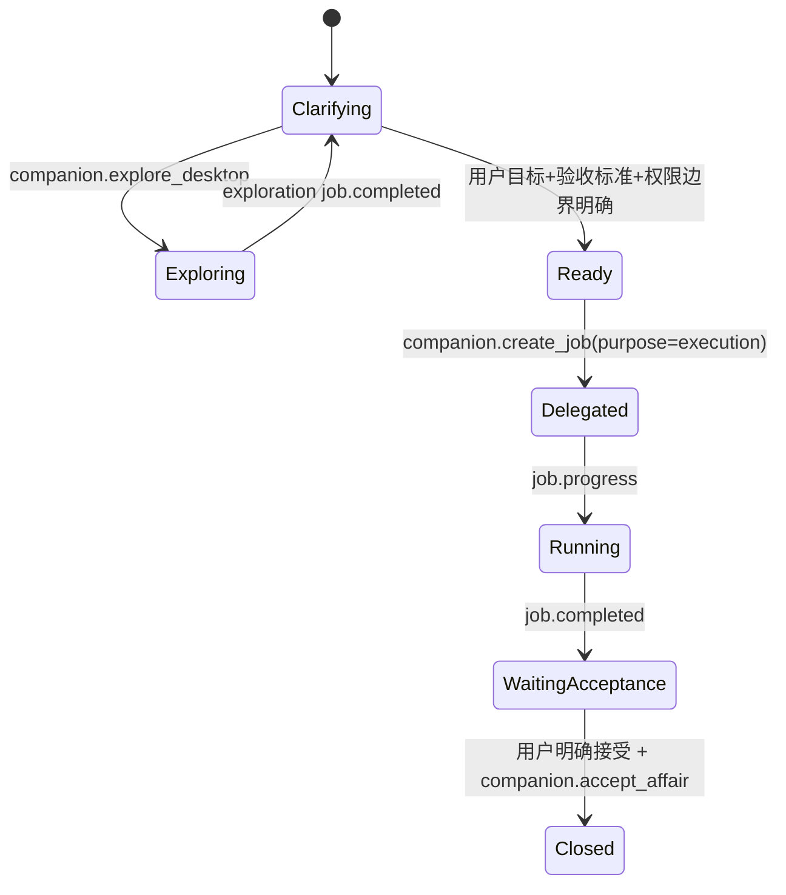
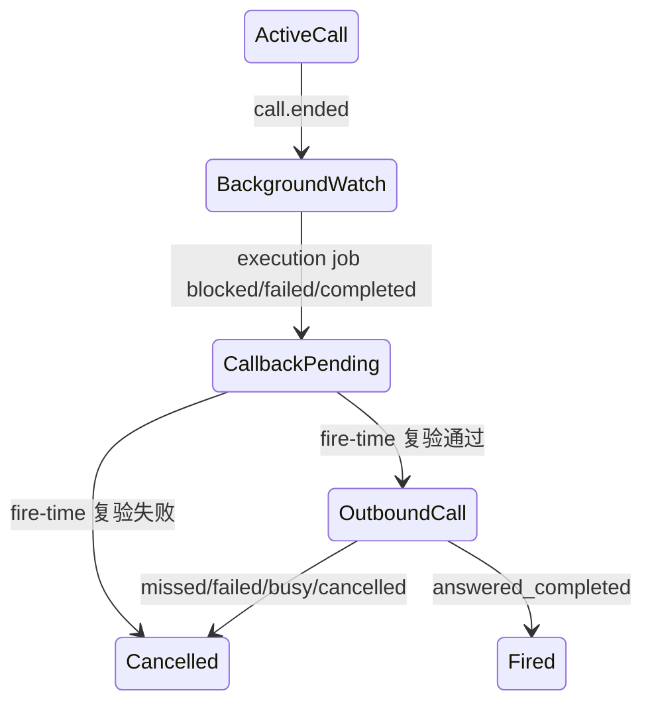

# 电话侧张老板连接事务闭环设计

> 适用范围：phone 仓库张老板 FC/runtime 与本仓库 companion 协议边界。  
> 原则来源：[携证状态转移原则.md](携证状态转移原则.md)。  
> 明确排除：API Key 同步、电话端屏幕 UI、手动输入电脑地址、companion 主动连接电话。

## 1. 目标

这版补齐四条链路：

1. 张老板可调用连接类 FC：查状态、发现电脑、准备连接、确认连接、断开。
2. 对话中的 pairing 状态机：用户通过自然语言确认，张老板再推进配对或重连。
3. 事务创建前的电脑探索能力：只读探索帮助澄清工作区，不产生正式执行承诺。
4. 后台监督到回电闭环：通话结束后继续盯 affair/job，状态变为阻塞或待验收时由张老板回电。

产品边界保持不变：

- 张老板是虚拟责任人，负责接事、确认标准、监督、回报和验收。
- Phone 侧只暴露 FC 和事务簿，不直接执行电脑文件/命令/git/网络副作用。
- Companion 是配对、session、权限和审计边界。
- OpenClaw 只负责执行 job，不拥有张老板人格、pairing identity 或 affair 关闭权威。

## 2. 携证状态

每个跨异步边界的推进都必须携带能证明“上一状态成立”的凭证。

| 状态对象 | Owner | 生命周期 | 可证明什么 | 不能证明什么 |
|----------|-------|----------|------------|--------------|
| Discovery candidate | phone 内存 | 默认约 60 秒 | 同一局域网短期发现到一个 companion 广告 | 已配对、已授权、可执行 |
| Connection intent | phone 内存 | 默认约 120 秒 | 某个候选被张老板选中，等待本通话用户确认 | 用户已同意、桌面已批准 |
| Pairing flow | phone + companion | request/challenge/confirmed/approved/completed | 电话侧与桌面侧双确认完成身份配对 | job 权限、执行权限 |
| Session | phone + companion | session.open/session.accepted/heartbeat/closed | 当前 socket 持有 pairing secret 的 HMAC proof | 任意 affair/job 自动可执行 |
| Exploration job | phone + companion | job.create/job.* | 张老板请求只读澄清上下文，`purpose=exploration` | 正式执行、事务完成、用户验收 |
| Execution job | phone + companion + OpenClaw | job.create/job.* | 用户目标、验收标准、权限声明已形成正式委派 | 用户已接受完成结果 |
| Callback task | phone task scheduler | pending/fired/cancelled | 后台 job 状态曾经达到 blocked/failed/completed，且回电前仍可复验 | 可基于旧提示直接关闭或继续 |

核心规则：

- discovery 不可跳过 connection intent。
- connection intent 不可跳过用户口头确认。
- pairing.completed 不可跳过 session.open。
- session.accepted 不可跳过 companion permission gate。
- job.completed 不可跳过 waiting_acceptance 与用户验收。
- callback task 必须 fire-time 复验 affair/job 当前状态。

## 3. FC 目录

张老板可用 FC 共 15 个，其中这版新增/补齐 7 个：

| FC | 作用 | 发送协议 |
|----|------|----------|
| `companion.get_connection_status` | 读本地连接/配对/session 状态 | 无 |
| `companion.discover_desktops` | mDNS 扫描电脑候选 | 无 |
| `companion.prepare_desktop_connection` | 候选转短期连接意图 | 无 |
| `companion.confirm_desktop_connection` | 用户确认后 pairing 或 session.open | `pairing.request`、`pairing.confirmed`、`session.open` |
| `companion.disconnect_desktop` | 关闭 session，不撤销 pairing | `session.closed` |
| `companion.explore_desktop` | 创建只读探索 job | `affair.create`、`job.create(purpose=exploration)` |
| `companion.accept_affair` | 用户验收后关闭 affair | `affair.close(status=closed)` |

原有执行与管理 FC 保持：`create_job`、`get_progress`、`pause_affair`、`resume_affair`、`cancel_job`、`cancel_affair`、`send_chat_context`、`fetch_pending_context`。

## 4. 对话状态机

### 4.1 发现与连接

张老板话术约束：

- 可以说“我这边看到一台叫 XX 的电脑，你要不要让我连上去？”
- 不能说“我已经能操作你电脑了”，只能说“连接好了，具体操作还要按事务和权限来”。
- 如果 discovery 找到多个候选，张老板只能根据候选名称/指纹向用户确认，不要求用户输入 IP/URL。

### 4.2 探索到正式事务

探索 job 只允许低风险读取，例如：

- `workspace.list_root`：列出可见工作区根/项目摘要。
- `git.status`：查看仓库状态。

探索 job 的 `completed` 只能写入 job 进度和 timeline，不得把 affair 推到 `waiting_acceptance`。

### 4.3 后台监督与回电

回电任务携带：

- `source=lanxin_claw_callback`
- `affairId`
- `jobId`
- `eventKind=job_completed|job_blocked|job_failed`
- `expectedAffairStatus`
- `expectedJobStatus`
- `fingerprint`

触发前必须重新读取 phone 侧事务簿：

- affair 已 closed/canceled：取消回电。
- job 已被新 job 替代、状态不匹配、或 purpose=exploration：取消回电。
- 电话当前忙：延后约 30 秒。
- 复验通过：外呼张老板，topic hint 要求先 `companion.get_progress` 再对用户说明。

## 5. 模块落点

Phone 仓库 `F:\workspace\persionalGitLib\doubaoSister`：

| 模块 | 文件 |
|------|------|
| FC 名称/常量 | `phone/systems/lanxinClaw/constants.js` |
| 短期候选/连接意图 | `phone/systems/lanxinClaw/connectionIntents.js` |
| pairing/session client | `phone/systems/lanxinClaw/pairingClient.js`、`sessionClient.js` |
| 事务簿 | `phone/systems/lanxinClaw/lanxinClawStore.js` |
| FC runtime | `phone/systems/lanxinClaw/lanxinClawRuntime.js` |
| Tool schema/handler | `phone/systems/lanxinClaw/companionTools.js`、`companionToolHandler.js` |
| 回电任务 | `phone/systems/tasks/taskScheduler.js`、`fireTask.js`、`buildTaskTopicHint.js` |
| 通话事件接线 | `phone/createPhoneRuntime.js`、`phone/app/composition/composeTaskRuntime.js` |

Claw 仓库：

| 模块 | 文件 |
|------|------|
| FC catalog | `packages/protocol/src/messages/companion-fc-catalog.ts` |
| Job payload/schema | `packages/protocol/src/messages/payloads/core.ts`、`schemas/job.schema.json` |
| Job validator/state | `packages/protocol/src/validators/payloads/affair-job/affair-job.ts`、`packages/protocol/src/states/job-status.ts` |
| Companion store/supervision | `apps/companion/src/state/store.ts`、`apps/companion/src/supervision/*` |
| OpenClaw adapter purpose 透传 | `packages/openclaw-adapter/src/jobs/*`、`apps/companion/src/jobs/delegation/*` |

## 6. 实施计划

1. Phone FC 扩展：登记 15 个工具，补连接类 schema、handler 异步回写、张老板提示词。
2. 连接状态机：实现 discovery candidate 与 connection intent，confirm 后走 pairing/session。
3. 事务探索：为 job 增加 `purpose`，探索 job 使用只读 permission，完成后不推进 affair。
4. 验收关闭：新增 `accept_affair`，只允许 `waiting_acceptance + execution completed + 用户接受摘要` 关闭。
5. 后台回电：通话结束转 background supervision；job terminal 生成携证 task；fire-time 复验。
6. Claw 协议同步：更新 FC catalog、Job schema/validator/state、companion store/supervision/adapter 目的字段。
7. 质量门禁：phone 窄测 + 全量测试；Claw protocol/companion/adapter 测试；按携证原则做对抗审查。

## 7. 验收标准

- 张老板能通过自然对话发现并请求用户确认连接电脑。
- 首次配对需要电话侧口头确认与桌面侧批准；重连需要 session.open proof。
- 未连接时 `create_job`/`explore_desktop` fail closed，不产生本地假成功。
- 探索 job 只能 `purpose=exploration`，完成后 affair 仍处于澄清/原状态。
- 正式 execution job completed 后只到 `waiting_acceptance`。
- 用户明确接受后 `accept_affair` 才能发 `affair.close(status=closed)`。
- 后台回电任务到点前必须复验状态；过期/失效/终态不外呼。
