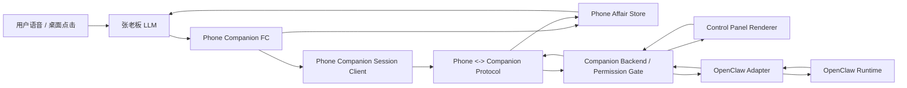
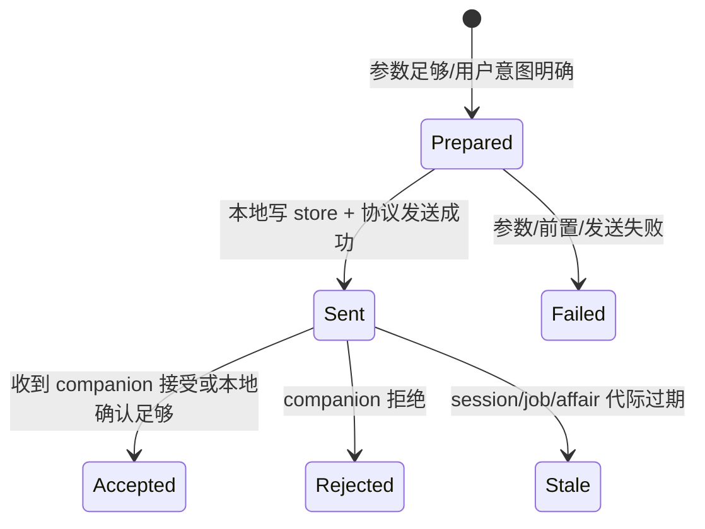
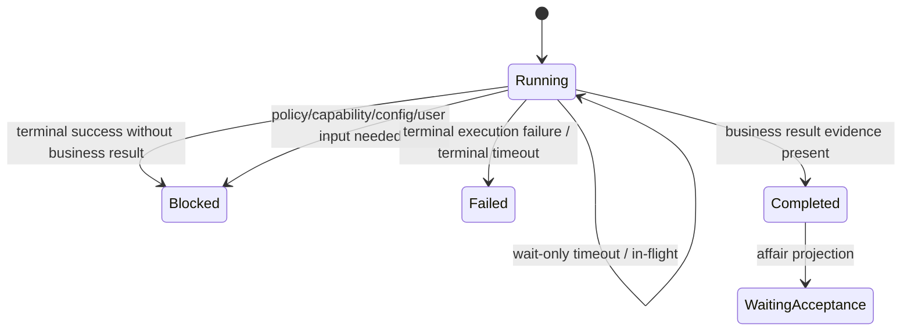
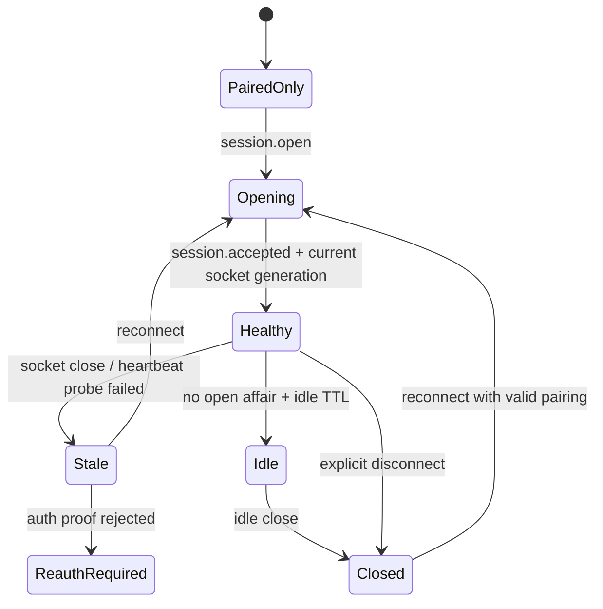
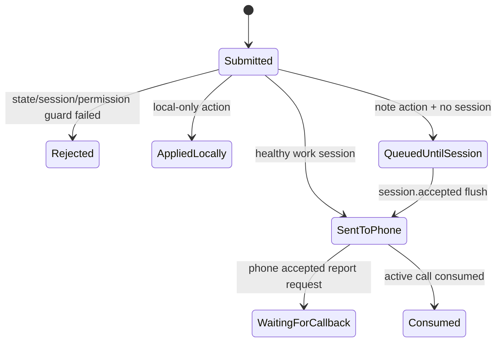
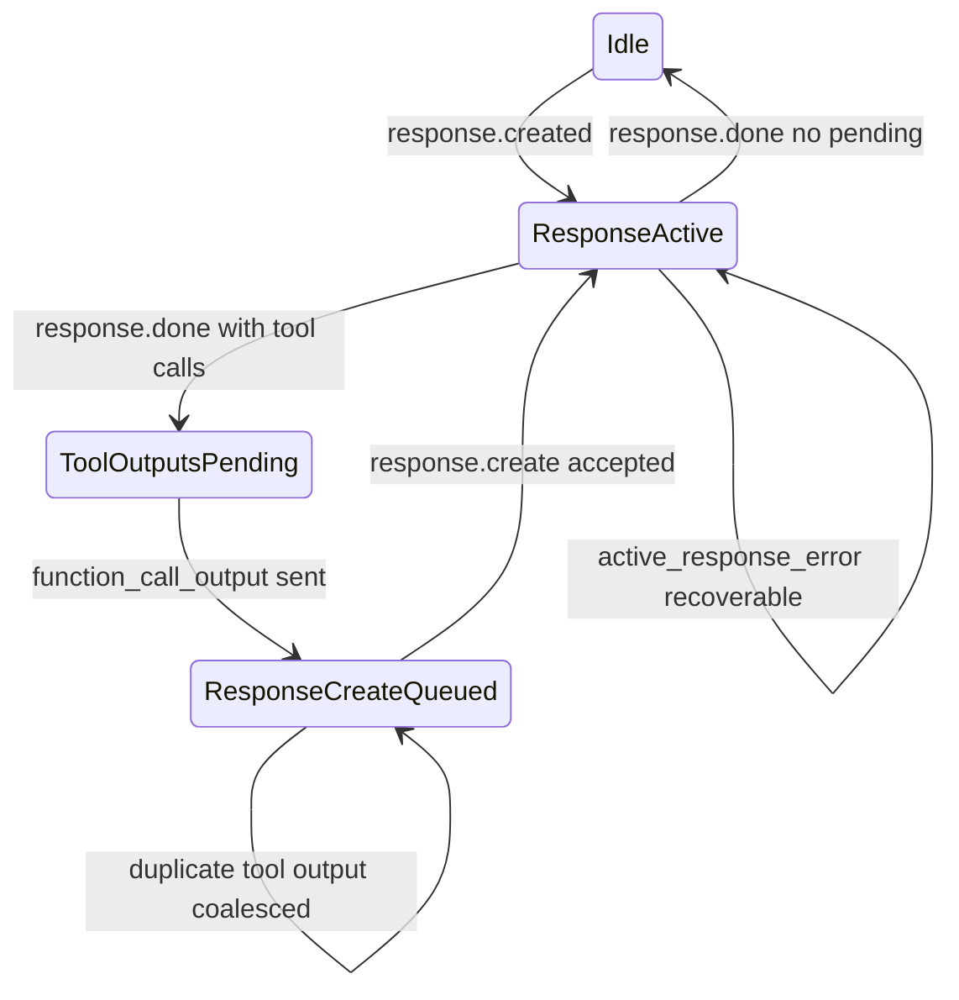

# Lanxin Claw 非 Happy Path 技术增强方案

## 0. 定位

本文不是对上一版设计的否定，也不是“发现一个 bug 修一个”的修复清单。

上一版已经把主干跑通：电话里的张老板可以通过 companion FC 找到电脑、建立 session、创建 job、等待桌面授权、委派 OpenClaw，并把状态投影到控制面板。真实通话暴露的问题说明主干方向成立，但一些隐含假设还没有升级为跨层可验证的技术合同。

本方案的目标是把非 happy path 下的状态真源、证据、转移、恢复和回报机制补强，使系统从“能跑通”增强为“失败不假阳、状态不串线、回报有证据、恢复可解释”。

依据：

- [非 Happy Path 根因审查报告](非HappyPath根因审查报告.md)
- [携证状态转移原则](携证状态转移原则.md)
- [复杂应用的携证状态与责任链设计原则](原则和规范/复杂应用的携证状态与责任链设计原则.md)
- [电话侧张老板连接事务闭环设计](电话侧张老板连接事务闭环设计.md)
- [OpenClaw 到 Lanxin 状态映射](OpenClaw到Lanxin状态映射.md)
- [OpenClaw 执行失败回报闭环](OpenClaw执行失败回报闭环.md)

非目标：

- 不做 API Key 同步体验项。
- 不新增硬件电话屏幕 UI、手动输入 IP/URL、电话端文件/命令/网络副作用。
- 不让 companion 主动连接电话。
- 不把张老板人格、事务簿或电话协议塞进 OpenClaw core。
- 不用大规模重写替代已有主链路；优先补硬合同、迁移、测试和观测。

## 1. 总体增强方向

保留四层 owner 不变：

| 层 | Owner | 仍然拥有 | 本轮增强 |
|----|-------|----------|----------|
| 张老板 / phone | 用户意图、自然对话、affair 连续性、最终验收语义 | 接事、澄清、确认、回报、监督 | 增加动作回执、话术门闩、active affair 健康检查、Realtime 串行化 |
| Companion | 配对、session、permission、桌面副作用门禁、本机 UI action | 安全边界与协议收发 | 增加 UI action 投递 receipt、session 健康代际、pending context 合同 |
| OpenClaw adapter | OpenClaw run/task/tool 到 Lanxin job 的防腐映射 | 执行事实裁决 | 强化业务完成证据、历史状态复投影、失败/阻塞回报 |
| OpenClaw runtime | 具体 worker 执行 | 工具、命令、浏览器、工作区执行能力 | 不扩大职责；只被 adapter 观察和防腐 |

新增七个增强合同：

1. **动作回执合同**：张老板声明“已连接、已发任务、已取消、已关闭、已验收”前，必须持有最近一次成功工具/协议 receipt。
2. **事务健康合同**：`activeAffairId` 只能指向健康、可继续推进的事务；running affair + terminal current job 是坏状态。
3. **OpenClaw 业务证据合同**：runtime 结束不等于业务完成；`job.completed` 必须有可验收业务证据。
4. **会话生命周期合同**：区分电话语音通话 session 与 companion 工作 session；工作 session 必须可判活、可判旧。
5. **UI 意图投递合同**：控制面板按钮提交的是可审计意图，结果必须显示 sent / queued / rejected / waiting。
6. **Realtime 响应串行合同**：工具输出后的 `response.create` 由单一调度器串行化，不能与服务端 active response 打架。
7. **跨端诊断合同**：phone FC、protocol DTO、adapter evidence、UI action 用同一组关联 ID 可追踪。

## 2. 端到端目标架构



硬规则：

- 自然语言不是状态证据。
- UI 可显示意图，但不能伪装成协议已送达或电话已消费。
- `messageId/correlationId/actionReceiptId/affairId/jobId/sessionId/runId` 是跨边界排障和幂等的最小证据集。
- 任何无法证明 owner、对象、代际、前置状态和权限的动作，默认 fail-closed。

## 3. 增强一：动作回执与张老板话术门闩

### 3.1 设计增强点

把“张老板想做某事”与“系统已经做成某事”分开。

张老板只有在拿到成功动作回执后，才能对用户说：

- “电脑已经连接上了。”
- “任务请求已经发到电脑端了。”
- “旧任务已经取消/关闭了。”
- “电脑端已经开始执行/正在等授权。”
- “事务已经关闭了。”

没有回执时，只能说：

- “我准备发过去。”
- “我还没拿到电脑端确认。”
- “我刚才查到的是旧任务，不代表这件新事已经开始。”

### 3.2 技术落点

新增 phone 本地 `ActionReceipt` 概念。它不是新的 OpenClaw 能力，而是 phone runtime 对高风险 FC 结果的结构化记录。

建议形状：

```ts
type ActionReceiptStatus =
  | "prepared"
  | "sent"
  | "accepted"
  | "queued"
  | "rejected"
  | "failed"
  | "stale";

interface ActionReceipt {
  actionReceiptId: string;
  actionKind:
    | "desktop_connection"
    | "job_create"
    | "job_cancel"
    | "affair_cancel"
    | "affair_accept"
    | "context_send"
    | "progress_read";
  status: ActionReceiptStatus;
  observedAt: string;
  callSessionId: string | null;
  companionSessionId: string | null;
  affairId: string | null;
  jobId: string | null;
  permissionRequestId: string | null;
  correlationId: string | null;
  reasonCode: string | null;
  allowedClaims: string[];
  forbiddenClaims: string[];
}
```

消费规则：

- FC runtime 生成 receipt。
- call-turn logger 落盘 receipt 摘要。
- 张老板工具输出中包含 `allowedClaims/forbiddenClaims`。
- Realtime 后续 response 由 receipt 生成临时高优先级指令，要求按 receipt 口径回应。
- 通话审计器在 transcript 出现无 receipt 成功话术时，必须记录 violation；若通话仍在，立即注入纠偏上下文并要求张老板自我修正。
- 业务状态机不得消费自然语言成功话术。即使张老板说错，也不能让 affair/job/session 进入成功态。

### 3.3 文件级改造

Phone repo：

| 文件 | 改造 |
|------|------|
| `phone/systems/lanxinClaw/actionReceipts.js` | 新增 receipt 构造、校验、摘要、claim 判定工具 |
| `phone/systems/lanxinClaw/lanxinClawRuntime.js` | 每个高风险 FC 返回 receipt；`sendPhone` 成功/失败写入不同 status |
| `phone/systems/lanxinClaw/companionToolHandler.js` | 工具结果统一包上 receipt；异步结果同样处理 |
| `phone/systems/lanxinClaw/companionTools.js` | 工具说明改为“按 receipt 说话”，减少自由 hint |
| `phone/shared/logging/callTurnLogger.js` | `turn.tool_result` 增加 receipt 摘要、actionKind、reasonCode |
| `phone/adapters/realtime/sessionUpdate.js` | 注入当前通话可见的最近 receipt 摘要 |
| `phone/systems/lanxinClaw/*.test.js` | 覆盖无 receipt 不得声称成功、receipt 字段脱敏、失败 receipt 文案 |

Lanxin Claw repo：

| 文件 | 改造 |
|------|------|
| `packages/protocol/src/messages/*` | 若需要跨端传 receipt，复用 `correlationId`，只在兼容期增加可选字段 |
| `schemas/*` | 可选扩展 `actionReceiptId` 时同步 schema；不得改成必填直到 phone/desktop 双端完成 |
| `docs/共同维护/技术设计/张老板伴侣工具.md` | 更新 FC 结果口径和话术门闩 |

### 3.4 状态机变化

不新增 affair/job 状态。新增的是“动作主张状态”：



张老板话术只能从 receipt 推导，不能从意图推导。

### 3.5 兼容与迁移

- `ActionReceipt` 先作为 phone 本地结构，不要求 desktop 立即理解。
- wire 层优先复用 envelope `correlationId`；新增字段必须可选。
- 旧日志没有 receipt，审计器只标“不可证明”，不回写旧业务状态。
- 不记录 token、authProof、pairingSecret、完整路径或完整工具参数。

### 3.6 测试矩阵

| 测试 | 期望 |
|------|------|
| `confirm_desktop_connection` 成功 | receipt=`desktop_connection/accepted`，允许说“已连接” |
| `create_job` send `job.create` 失败 | receipt=`job_create/failed`，禁止说“任务已发” |
| 模型只说“我这就发”但未调用工具 | 日志无 success receipt；审计标记为未证明动作 |
| `cancel_affair` 未发出协议 | 禁止说“旧任务已关” |
| receipt 含敏感字段 | 构造失败或脱敏 |

## 4. 增强二：Active Affair 健康与读修复

### 4.1 设计增强点

`activeAffairId` 不能是简单指针。它必须是一个派生选择：只指向当前可继续推进、状态组合自洽、没有被终态 job 破坏的事务。

坏状态示例：

- 事务状态为 `running`，但当前执行 job 已是 `canceled`。
- affair=`running`，current job=`failed`，但没有 blockedReason/resumeCondition。
- affair=`active_call`，但 `callSessionId` 属于早已结束的通话。
- phone 认为 affair running，desktop mirror 认为同一 affair canceled。

### 4.2 技术落点

引入派生 `AffairHealth`，不作为协议状态：

```ts
type AffairHealthStatus =
  | "healthy"
  | "terminal"
  | "stale_call"
  | "terminal_job_mismatch"
  | "missing_current_job"
  | "remote_conflict";

interface AffairHealth {
  affairId: string;
  health: AffairHealthStatus;
  reasonCode: string;
  canBeActive: boolean;
  suggestedProjection: "keep" | "background" | "canceled" | "blocked" | "waiting_acceptance" | "clear_active";
}
```

核心规则：

- `pickOpenAffairId` 必须过滤 `canBeActive=false` 的 affair。
- `get_connection_status` 返回 active affair 时必须带 health；不健康时只给诊断，不给张老板当作当前任务。
- `get_progress` 默认读取健康 active affair；如果指定了不健康 affair，要把 health 返回给张老板。
- read repair 可修复旧数据，但不得自动 closed。

### 4.3 文件级改造

Phone repo：

| 文件 | 改造 |
|------|------|
| `phone/systems/lanxinClaw/affairHealth.js` | 新增健康判定与投影建议 |
| `phone/systems/lanxinClaw/lanxinClawStore.js` | `repairActiveAffairId` 改为全量 affair + job 健康检查；读取/写入/启动均执行 |
| `phone/systems/lanxinClaw/lanxinClawRuntime.js` | `getConnectionStatus/getProgress/onCallEnded` 使用健康结果；旧 active_call 转 background |
| `phone/systems/lanxinClaw/lanxinClawStore.test.js` | 增加 legacy fixture：running + canceled current job |
| `phone/systems/lanxinClaw/lanxinClawRuntime.test.js` | 确认旧 active 不污染新任务 |

Lanxin Claw repo：

| 文件 | 改造 |
|------|------|
| `apps/companion/src/state/store.ts` | 保留 hydrate mirror 反推修复，并补不复活终态测试 |
| `apps/companion/src/state/projector.ts` | UI snapshot 可展示 health/conflict 摘要 |
| `schemas/control-panel-snapshot.schema.json` | 若展示 health，增加可选字段并同步 validator |
| `docs/共同维护/技术设计/电话侧事务簿.md` | 补 active affair 健康与读修复规则 |

### 4.4 状态机变化

不新增 `AffairStatus`。增强规则是：

| 当前组合 | 修复后 |
|----------|--------|
| `running + current job running` | 保持 healthy |
| `running/delegated + current job canceled` | 若有 `affair_cancel` receipt 则 affair -> `canceled`；否则 affair -> `blocked` 或 clear active，reason=`last_execution_canceled`；不得继续显示 running |
| `running/delegated + current job failed` | affair -> `blocked` |
| `running/delegated + current job completed` | affair -> `waiting_acceptance` |
| `active_call + callSessionId 已结束` | 监督态改为 `background`，`callSessionId` 清为 null |
| `closed/canceled + 迟到 job.progress` | 忽略并记 timeline |

### 4.5 兼容与迁移

- `schemaVersion=1` 可先 read-repair，不强行整体迁移。
- 修复前先写 timeline：`health_repair`，记录 from/to 和 reasonCode。
- 修复不删除旧 affair；只是更新状态或移出 active。
- phone 与 desktop 冲突时先标 `remote_conflict`，不乐观采用“running”。

### 4.6 测试矩阵

| 测试 | 期望 |
|------|------|
| legacy running affair + canceled current job | `getActiveAffair()` 不返回该 affair 作为健康 active；无 affair_cancel receipt 时不得自动 closed/canceled |
| running affair + completed current job | 投影到 `waiting_acceptance` |
| old active_call session | 挂机/启动后转 background |
| closed affair 收到 progress | 不复活 |
| desktop mirror canceled、phone running | 标 conflict 或本地修复，不静默当 running |

## 5. 增强三：OpenClaw 业务完成证据门闩

### 5.1 设计增强点

OpenClaw 的 run/task/tool 结束，只能证明 worker 生命周期结束。Lanxin 的 `job.completed` 必须证明“产生了一版可让用户验收的业务结果”。

以下不能单独证明业务完成：

- `agent.wait ok`
- `endedAt`
- `stop`
- `ok`
- `done`
- 空 final reply
- 没有成功工具证据的 runtime terminal success

### 5.2 技术落点

以 adapter evidence decision 层为唯一入口：

```ts
interface JobDecisionEvidence {
  jobId: string;
  runId: string | null;
  sessionKey: string | null;
  evidenceKind: string;
  strength: "strong" | "medium" | "weak";
  reasonCode: string;
  observedAt: string;
  businessResultPresent: boolean;
  negativeEvidencePresent: boolean;
}
```

映射规则：

- 强/中等业务结果证据 + 无负证据 -> `job.completed`。
- terminal success 但无业务结果 -> `job.blocked`，`statusReasonCode=openclaw.terminal_without_result`。
- final reply 明确失败或策略阻塞 -> `job.blocked`。
- tool/audit failed -> `job.failed` 或 `job.blocked`。
- wait-only timeout -> 保持 `running`。
- terminal timeout -> `failed`。

完成证据按任务风险分层：

| 任务类型 | final text 可否单独证明 completed | 需要的最低完成证据 |
|----------|------------------------------------|--------------------|
| 纯信息总结 / 无桌面副作用 | 可作为弱到中等证据，但必须非负、非低信号，并带 observedAt/reasonCode | final reply 有具体结果摘要 |
| 浏览器/网络/工具查询 | 不可单独证明；必须有工具成功或 task result | tool succeeded 且摘要含业务结果、task result 或抓取内容摘要；只打开浏览器/空白页不算完成 |
| 文件写入、命令、git、桌面控制 | 不可单独证明 | 对应工具成功证据、路径/命令摘要、permission 绑定 |
| 权限/配对/session 操作 | 不可单独证明 | companion gate 或 protocol ack |

### 5.3 文件级改造

Lanxin Claw repo：

| 文件 | 改造 |
|------|------|
| `packages/openclaw-adapter/src/evidence/openclaw-execution-evidence.ts` | 规范 evidence 字段，禁止用低信号文本当成功 |
| `packages/openclaw-adapter/src/mapping/decide-job-from-evidence.ts` | 完成态统一经 `hasBusinessCompletionEvidence` |
| `packages/openclaw-adapter/src/mapping/decision/evidence-helpers.ts` | 归一 low-signal / negative / blocked / timeout 判断 |
| `packages/openclaw-adapter/src/client/gateway/raw-ws/evidence/*` | 从 Gateway raw event 只抽取防腐后的 evidence |
| `apps/companion/src/state/store.ts` | job -> affair 投影只认 adapter decision 后的 `job.completed` |
| `apps/companion/src/ui/pages/tasks/*` | 展示 blocked / terminal_without_result，不显示假待验收 |
| `apps/companion/tests/*` | 增加 stop/endedAt/final negative/failed tool 反例 |

Phone repo：

| 文件 | 改造 |
|------|------|
| `phone/systems/lanxinClaw/lanxinClawStore.js` | 消费 `job.blocked/failed/completed` 时保存 reasonCode/observedAt |
| `phone/systems/lanxinClaw/companionTools.js` | 张老板回报 blocked/failed/completed 的口径与 evidence 分层对齐 |

### 5.4 状态机变化



`Completed` 是 job 状态；affair 只投影到 `waiting_acceptance`，永远不自动 `closed`。

### 5.5 兼容与迁移

- 已存在 `progressSummary=stop` 且 `statusReasonCode=openclaw.run_completed` 的历史 job，需要启动时复投影为 blocked。
- adapter job store 增加 schemaVersion 或 migration marker。
- 旧 UI snapshot 若没有 evidence 字段，仍按 status 显示；但从迁移后不再产生假 completed。

### 5.6 测试矩阵

| 测试 | 期望 |
|------|------|
| terminal reason=`stop` | `job.blocked/openclaw.terminal_without_result` |
| wait ok + only endedAt | `job.blocked` |
| wait timeout but run 未终态 | 保持 `running` |
| tool failed + final says done | `failed/blocked`，不能 completed |
| final negative browser policy | `blocked`，回报策略限制 |
| task 已完成且有有效结果摘要 | `completed`，affair -> `waiting_acceptance` |

## 6. 增强四：会话生命周期与代际健康

### 6.1 设计增强点

把两个 session 拆清楚：

- **Voice Call Session**：电话语音通话 / Realtime 会话，生命周期随通话。
- **Companion Work Session**：phone 与 desktop companion 的 WebSocket/HMAC 工作会话，可跨语音通话存在，用于后台监督与状态同步。

上一版的问题在于两者混用：挂断语音通话后，工作 session 仍在 heartbeat；下一通电话又把旧 affair 和旧 session 状态带进当前对话。

推荐裁决：

- Companion Work Session 可以 durable，但必须有明确健康判定和 session generation。
- Voice Call Session 结束时，只把 affair supervision 从 `active_call` 切到 `background`，不自动关闭仍需后台监督的 work session。
- 没有 open affair 时，work session 可进入 idle TTL，之后主动关闭。
- 每次新语音通话开始，`get_connection_status` 必须先复验 work session 是否当前 socket 健康；不能只读旧 `sessionStatus=accepted`。

### 6.2 技术落点

新增派生 `CompanionSessionHealth`：

```ts
type CompanionSessionHealth =
  | "none"
  | "paired_only"
  | "opening"
  | "healthy"
  | "stale"
  | "closed"
  | "reauth_required";

interface CompanionSessionSnapshot {
  sessionId: string | null;
  sessionGeneration: number;
  socketGeneration: number;
  health: CompanionSessionHealth;
  lastAcceptedAt: string | null;
  lastInboundAt: string | null;
  lastHeartbeatSentAt: string | null;
  lastHeartbeatAckAt: string | null;
  staleReason: string | null;
}
```

健康判定：

- WebSocket 未 open -> `stale/closed`。
- `session.accepted` 不属于当前 socket generation -> `stale`。
- 落盘 `session.accepted` 的 `sessionId/sessionGeneration/socketGeneration` 不匹配当前 runtime 持有的 session 与 socket 代际 -> `stale`；旧 accepted 记录不能跳过新的 `session.open`。
- 最近 heartbeat 没有 companion 侧确认 -> `stale`。
- companion 主动 `session.closed/reauth_required` -> 对应终态。
- desktop 侧认证 WebSocket 关闭且没有其他认证 socket 时，companion 必须立即把工作 session 标为失联，不能等到 heartbeat timeout 才暴露。
- 只有 paired identity -> `paired_only`，不能委派 job。

### 6.3 文件级改造

Phone repo：

| 文件 | 改造 |
|------|------|
| `phone/systems/lanxinClaw/sessionClient.js` | 增加 session/socket generation、heartbeat ack 或 liveness probe |
| `phone/systems/lanxinClaw/lanxinClawRuntime.js` | `ensureReady` 改用 health；新通话 `getConnectionStatus` 触发复验 |
| `phone/systems/lanxinClaw/lanxinClawStore.js` | session 落盘记录 generation/health/staleReason |
| `phone/createPhoneRuntime.js` | call start/end 与 work session 关系显式接线 |
| `phone/systems/lanxinClaw/lanxinClawRuntime.test.js` | 第一通连接挂断、第二通重连、旧 session 假阳反例 |

Lanxin Claw repo：

| 文件 | 改造 |
|------|------|
| `packages/protocol/src/messages/payloads/session*` | 可选增加 `sessionGeneration`、heartbeat ack 或 probe payload |
| `schemas/*session*.json` | 可选字段兼容扩展 |
| `apps/companion/src/protocol-server/server.ts` | 记录 session generation、socket generation、heartbeat ack/close |
| `apps/companion/src/backend/runtime.ts` | connection snapshot 区分 authenticated 与 healthy |
| `apps/companion/tests/protocol-server/*` | heartbeat timeout、reopen、stale message 反例 |

### 6.4 状态机变化



`Healthy` 才能 create/explore/cancel/accept outbound action。`PairedOnly`、`Stale`、`Closed` 都不能作为执行授权前置。

### 6.5 兼容与迁移

- 旧 session 文件缺 generation 时，启动后标 `stale`，要求重新 session.open。
- 初期可没有 heartbeat ack，先用 socket open + inbound event + timeout 组合判定；最终补 ack/probe。
- session health 是连接事实，不得自动改变 affair status，只能影响是否允许新委派。

### 6.6 测试矩阵

| 测试 | 期望 |
|------|------|
| 旧 sessionStatus=accepted 但 socket closed | `ensureReady` 拒绝，提示重连 |
| 第一通连接后挂断且有后台任务 | work session 可继续，但 voice call supervision 转 background |
| 第一通连接后挂断且无任务 | idle TTL 后 close |
| 第二通电话开始 | 先复验 session health，不使用假阳 accepted |
| 旧 socket 的 heartbeat/progress | 不推进当前 session generation |

## 7. 增强五：UI 意图投递与张老板回报闭环

### 7.1 设计增强点

控制面板按钮不是业务结果。点击按钮后必须告诉用户这次意图处于哪种投递状态：

- `sent_to_phone`：已通过 authenticated work session 发给 phone。
- `queued_until_session`：已在 companion 本地排队，等 phone 下次建立 session 再发送。
- `rejected`：状态/权限/会话前置不满足，未接受。
- `applied_locally`：只影响本机展示或权限 gate，不代表 phone 已消费。
- `waiting_for_callback`：phone 已收到并安排张老板后续回报。

重要裁决：

- `affair.accept`、`affair.cancel`、`affair.requestRevision` 会改变事务或执行状态，默认要求 healthy work session；离线时不能伪装成功关闭。
- `affair.requestAcceptance` 本质是“请求张老板回报状态”的 note，可以离线排队，但 UI 必须显示 queued，而不是让用户以为张老板已经知道。
- 若 phone 收到 requestAcceptance 且当前无语音通话，应由 phone 侧监督/任务系统决定是否回电；companion 不能主动连接电话。

### 7.2 技术落点

扩展 `BridgeActionResult`：

```ts
interface BridgeActionDelivery {
  actionReceiptId: string;
  status:
    | "sent_to_phone"
    | "queued_until_session"
    | "rejected"
    | "applied_locally"
    | "waiting_for_callback";
  affairId: string | null;
  jobId: string | null;
  deliveredAt: string | null;
  reasonCode: string | null;
  message: string;
}
```

处理规则：

- `requestAcceptance` 离线时进入 pending context，result=`queued_until_session`。
- session accepted 后 flush pending context，并用同一个 `actionReceiptId` 记录后继 `sent_to_phone` delivery；UI 可以看见 queued -> sent 的连续证据。
- phone 收到 `chat.context_attach` 后写 `pendingContext`，张老板通过 `fetch_pending_context` 或回电 topic 消费。
- UI 显示最近 action receipt，不再只有 error。

### 7.3 文件级改造

Lanxin Claw repo：

| 文件 | 改造 |
|------|------|
| `apps/companion/src/bridge/contract.ts` | 扩展 `BridgeActionResult` 和 `ControlPanelSnapshotView` 中的 recent action receipts |
| `apps/companion/src/backend/bridge-action-policy.ts` | `requestAcceptance` 从强 session gate 中拆出，按 note 排队；高风险 action 仍 fail-closed |
| `apps/companion/src/protocol-server/bridge-actions.ts` | 返回 delivery status，不再只返回 string error |
| `apps/companion/src/shell/desktop/bridge-outbound.ts` | 写入 delivery receipt，flush 后更新状态 |
| `apps/companion/src/backend/runtime.ts` | audit store 增加 UI action delivery 记录 |
| `apps/companion/src/ui/pages/tasks/*` | 按 sent/queued/rejected 显示用户可见反馈 |
| `schemas/control-panel-snapshot.schema.json` | 增加 recent action receipts 可选字段 |
| `apps/companion/tests/backend/*` | 覆盖 requestAcceptance 离线排队和高风险 action 离线拒绝 |

Phone repo：

| 文件 | 改造 |
|------|------|
| `phone/systems/lanxinClaw/lanxinClawRuntime.js` | `fetch_pending_context` 消费 requestAcceptance note 后，复验 progress |
| `phone/systems/tasks/*` | phone 收到需回报 context 后可调度张老板回电，fire-time 复验 |
| `phone/systems/lanxinClaw/lanxinClawRuntime.test.js` | requestAcceptance context -> 回报/回电路径 |

### 7.4 状态机变化



UI action delivery 不等于 affair/job 状态。它只证明“用户意图走到哪里了”。

### 7.5 兼容与迁移

- 旧 renderer 若不认识 `delivery` 字段，仍能按 `ok/error` 工作。
- 后端保存 recent receipt 数量有限，例如最近 50 条，避免无限增长。
- pending context 已存在时，补 `actionReceiptId` 可选字段；旧队列项继续可 flush。

### 7.6 测试矩阵

| 测试 | 期望 |
|------|------|
| 离线点击“让张老板回报” | result ok + delivery=`queued_until_session`，UI 可见 |
| 在线点击“让张老板回报” | delivery=`sent_to_phone`，phone 收到 context |
| 离线点击“接受结果” | rejected/session_required，不关闭事务 |
| session accepted 后 flush pending | pending context 清空，同一 `actionReceiptId` 从 queued 更新为 sent_to_phone |
| UI action 成功但 phone 未消费 | UI 显示 sent/等待消费，不说已回报 |

## 8. 增强六：Realtime 响应串行化

### 8.1 设计增强点

工具输出后的 `response.create` 不能由每个 tool handler 直接发。Realtime 服务端对一个 conversation 同时只能有一个 active response；本地 `isResponding=false` 并不等于服务端没有 active response。

### 8.2 技术落点

引入单一 `ResponseScheduler`：

```ts
interface ResponseSchedulerState {
  serverResponseId: string | null;
  createInFlight: boolean;
  createQueued: boolean;
  lastCreateSentAt: string | null;
  pendingToolOutputCount: number;
  lastServerErrorCode: string | null;
}
```

规则：

- `sendFunctionCallOutput` 只提交 tool output，不直接发 `response.create`。
- `requestResponseAfterToolOutput()` 合并同一批工具结果，只排一个 response。
- 只有收到 `response.done`、`response.cancelled` 或确认 active response 清空后，才真正发 `response.create`。
- 服务端返回 `Conversation already has an active response` 时，标记 recoverable，延迟重试或等待下一次 `response.done`，不直接清空通话上下文。
- 日志中记录 scheduler 状态。

### 8.3 文件级改造

Phone repo：

| 文件 | 改造 |
|------|------|
| `phone/adapters/realtime/responseScheduler.js` | 新增调度器纯逻辑 |
| `phone/adapters/realtime/client.js` | `createResponse` 改为 scheduler 驱动；处理 active response error |
| `phone/systems/lanxinClaw/companionToolHandler.js` | 调用 `requestResponseAfterToolOutput`，不直接裸 `createResponse` |
| `phone/adapters/realtime/*.test.js` | 并发 response、迟到 done、多 tool output、active response error 反例 |

### 8.4 状态机变化



### 8.5 兼容与迁移

- 对非 companion tool 同样适用，避免全局 realtime 通话乱序。
- 初期不改变外部 API，只替换内部 `createResponse` 实现。
- 错误恢复要保守：宁可少说一句，也不要断线或重复 response。

### 8.6 测试矩阵

| 测试 | 期望 |
|------|------|
| 同一 response 产生多个 tool call | 只发一次后续 `response.create` |
| `isResponding=false` 但服务端报 active response | 不断线，等待/重试 |
| 迟到 `response.done` 属于旧 response | 不清当前 active |
| 用户打断后工具结果迟到 | 不创建错误后续 response |
| 用户打断前已收集但未执行的 function call | 清空 pending tool calls，不再执行旧轮工具 |
| 连续两轮 tool output | 每轮 response 串行 |

## 9. 增强七：跨端诊断与 DTO 落盘

### 9.1 设计增强点

任一问题必须能沿一条线追：

```text
callSessionId
  -> toolCallId
  -> actionReceiptId
  -> protocol messageId/correlationId
  -> affairId/jobId
  -> permissionRequestId
  -> openclaw runId/sessionKey
  -> UI snapshot/action receipt
```

### 9.2 技术落点

新增诊断聚合模型：

```ts
interface DiagnosticTraceIndex {
  traceId: string;
  callSessionId: string | null;
  companionSessionId: string | null;
  actionReceiptId: string | null;
  messageIds: string[];
  correlationIds: string[];
  affairId: string | null;
  jobId: string | null;
  runId: string | null;
  status: string;
  reasonCode: string | null;
  updatedAt: string;
}
```

规则：

- phone `turn.tool_result` summary 必须包含核心 ids 和 reasonCode。
- desktop protocol log 继续落完整脱敏 DTO。
- adapter job store 记录最后一次 evidence decision。
- UI 诊断页可按 affair/job/session 过滤。
- 所有诊断数据默认本机私有，导出需脱敏。

### 9.3 文件级改造

Phone repo：

| 文件 | 改造 |
|------|------|
| `phone/shared/logging/callTurnLogger.js` | tool result / tool handled / realtime error 增加 trace 字段 |
| `phone/systems/lanxinClaw/lanxinClawRuntime.js` | FC 返回统一 reasonCode、statusObservedAt、correlationId |
| `phone/systems/lanxinClaw/lanxinClawStore.js` | timeline 写入 messageId/actionReceiptId |

Lanxin Claw repo：

| 文件 | 改造 |
|------|------|
| `apps/companion/src/protocol-server/protocol-log-dto.ts` | 统一 DTO 落盘脱敏与摘要 |
| `apps/companion/src/backend/runtime.ts` | audit/snapshot 加 trace index |
| `packages/openclaw-adapter/src/*` | adapter decision 写入 runId/sessionKey/evidenceKind/reasonCode |
| `apps/companion/src/ui/pages/diagnostics/*` | 诊断页按 trace 聚合显示 |
| `docs/共同维护/技术设计/日志系统.md` | 记录新 trace 字段和脱敏规则 |

### 9.4 状态机变化

诊断不改变业务状态机。它只记录状态主张的证据链，不允许作为成功状态的替代证据。

### 9.5 兼容与迁移

- 新 trace index 从新增日志开始；旧日志只做 best-effort 解析。
- DTO 中的 `authProof`、secret、token 继续 redacted。
- 日志缺字段时不阻断运行，但诊断页标“证据不足”。

### 9.6 测试矩阵

| 测试 | 期望 |
|------|------|
| `create_job` 成功 | phone log、desktop DTO、adapter job 可用同一 correlation 追踪 |
| `job.blocked` | UI、phone、adapter 都显示同一 reasonCode |
| realtime active response error | 日志含 scheduler state |
| 导出诊断 | 不含 API key、authProof、pairingSecret |
| 旧日志解析 | 标证据不足，不误判成功 |

## 10. 实施顺序

### 阶段 0：合同冻结

目标：先固定增强合同，避免实现时继续漂移。

文件：

- `docs/共同维护/技术设计/非HappyPath技术增强方案.md`
- `docs/共同维护/技术设计/张老板伴侣工具.md`
- `docs/共同维护/技术设计/电话侧事务簿.md`
- `docs/共同维护/技术设计/OpenClaw到Lanxin状态映射.md`
- `docs/共同维护/技术设计/控制面板数据契约.md`

验收：

- 每个 P0/P1 RCA 都能映射到一个增强合同。
- 每个增强合同都有 owner、技术落点、文件级改造、状态机变化、兼容/迁移、测试。

### 阶段 1：phone P0 防假阳

目标：先让张老板不再制造假成功和旧事务污染。

交付：

- action receipt。
- active affair 健康读修复。
- `get_connection_status/get_progress/create_job/cancel/accept` 的 receipt 和 health 输出。
- 无 receipt 成功话术审计。

验收：

- 复放 `a9f20e65...` 场景：无 `create_job` 时不能说“任务已发”。
- legacy active affair 不再污染新任务。
- 旧 active_call 不再跨通话伪装当前通话。

### 阶段 2：desktop / adapter P0 防假完成

目标：OpenClaw 停止或空结果不再被系统显示为已完成。

交付：

- evidence-gated completion。
- 终态但无业务结果时转为 blocked。
- 历史 adapter job / backend mirror 复投影。
- UI waiting_acceptance / blocked 文案修正。

验收：

- `stop/endedAt/wait.completed only` 不进入 completed。
- 浏览器策略阻塞能在 UI 和张老板回报里显示 blocked。

### 阶段 3：session 与 UI 投递闭环

目标：消除 session 假阳和 UI 点击没反馈。

交付：

- voice call session / companion work session 分离。
- session generation、socket generation 与健康判定。
- requestAcceptance 投递 receipt。
- pending context flush 与 phone 消费/回电合同。

验收：

- 第一通连接后挂断，第二通重连不依赖旧 accepted。
- UI 点击“让张老板回报”能显示 sent/queued/rejected，并最终被 phone 消费或明确失败。

### 阶段 4：Realtime 串行化

目标：减少工具调用后的通话乱序与 active response 断线。

交付：

- response scheduler。
- active response error 恢复。
- 多 tool output 合并创建 response。

验收：

- 同一 turn 不再出现多个非预期 `turn.assistant.start`。
- active response error 不导致业务上下文丢失。

### 阶段 5：诊断与实机回归

目标：每条状态链可追踪，非 happy path 可复现、可解释。

交付：

- trace index / DTO 落盘。
- 诊断页聚合。
- 实机回归脚本和检查清单。

验收：

- 任一 affair/job/session 可跨 phone、desktop、adapter 追踪。
- 周日夜间暴露的所有症状都有自动化或半自动复验入口。

## 11. 覆盖矩阵

| 根因 | 增强合同 | 是否覆盖 |
|------|----------|----------|
| RCA-01 张老板无工具证据声称任务已发 | 动作回执、话术门闩、诊断 trace | 覆盖 |
| RCA-02 旧 active affair 污染新任务 | Active Affair 健康与读修复 | 覆盖 |
| RCA-03 `stop` 被判 completed | OpenClaw 业务完成证据门闩 | 覆盖 |
| RCA-04 Realtime active response 断线 | Realtime 响应串行化 | 覆盖 |
| RCA-05 session 假阳/生命周期不清 | 会话生命周期与代际健康 | 覆盖 |
| RCA-06 prepare 错误话术 | 动作回执、allowed/forbidden claims | 覆盖 |
| RCA-07 UI 请求回报无反馈 | UI 意图投递合同、pending context 合同 | 覆盖 |
| RCA-08 跨端排障困难 | 跨端诊断与 DTO 落盘 | 覆盖 |

## 12. 同类问题消除规则

本方案不只覆盖已观察到的八个 RCA，还要阻断同类问题再次换形态出现。实施时按以下不变量验收：

| 问题类别 | 必须阻断的同类问题 | 消除机制 |
|----------|--------------------|----------|
| 无证据成功话术 | 张老板声称已发、已关、已开始、已完成，但没有对应 FC/protocol receipt | action receipt + allowed/forbidden claims + transcript violation correction；业务状态不消费话术 |
| 旧对象串线 | 旧 affair/job/session 被新通话当成当前任务 | affair health + session generation + current job 归属校验 |
| 终态复活 | canceled/closed/failed job 被迟到 progress/completed 覆盖 | terminal latch + canTransition + message/correlation 幂等 |
| 弱证据完成 | `stop/ok/done/final text` 被当成真实业务完成 | adapter evidence gate + task-risk policy |
| UI 假送达 | 用户点按钮后系统无反馈，或把 queued 说成 delivered | bridge delivery receipt + UI 可见 delivery state |
| 会话假阳 | 旧 accepted session、断开的 socket、旧 heartbeat 被当成可委派状态 | work session health + socket/session generation + stale recovery |
| 失败沉默 | OpenClaw/permission/session 失败只在日志里，不进业务状态 | failure productization：blocked/failed/needs_permission + reasonCode + resumeCondition |
| 诊断断链 | 无法从通话追到 protocol、adapter、UI | trace index + DTO 落盘 + 脱敏 audit |

验收口径：

- 任一成功态必须有强 owner 和证据链。
- 任一失败态必须有 reasonCode 和恢复建议。
- 任一异步事件必须能判定对象、代际、时效和幂等。
- 任一 UI/语音回报必须能说明自己是事实、意图、排队还是推测。

## 13. 总测试矩阵

| 层 | 测试包 | 必测非 happy path |
|----|--------|-------------------|
| phone FC | `phone/systems/lanxinClaw/*.test.js` | 无 session create_job、send 失败、旧 active affair、terminal job mismatch、receipt 脱敏 |
| phone realtime | `phone/adapters/realtime/*.test.js` | active response error、多 tool output、迟到 done、用户打断、打断后迟到工具输出不得自动说话、打断前 pending function call 不得执行 |
| phone scheduler | `phone/systems/tasks/*.test.js` | pending context 消费、回电前复验、终态取消回电 |
| protocol | `packages/protocol` validators + schema validate | optional receipt/generation 字段兼容、未知字段策略 |
| companion backend | `apps/companion/tests/backend/*` | UI action 门闩、requestAcceptance 排队、accept/cancel 失败关闭、mirror 只按 current job 修复 |
| protocol server | `apps/companion/tests/protocol-server/*` | session generation、heartbeat 超时、旧消息、pending 同 receipt 刷出、认证 socket close 立即失联、DTO 普通文本脱敏 |
| adapter | `packages/openclaw-adapter/tests/*` | stop/endedAt、负向 final、工具失败、wait 超时、终态超时、浏览器/命令任务的 process-only 成功反例 |
| UI projection | `apps/companion/tests/ui/*` | blocked/failed/waiting_acceptance 文案、delivery receipt 展示、snapshot 最近 delivery 可见、无假成功 |
| 实机 | phone + desktop manual matrix | 连上电脑、挂断重连、任务未创建不假报、OpenClaw 失败透明回报 |

## 14. 原则对抗审查与修订

### 审查轮 1

| 问题 | 严重度 | 审查意见 | 修订结果 |
|------|--------|----------|----------|
| 动作回执可能变成“没人消费的字段” | P1 | 原则 6 禁止新增无人校验字段 | 已要求 FC runtime、call-turn logger、张老板工具输出、审计器共同消费 receipt |
| session durable 可能继续制造假阳 | P1 | 原则 2/5 要求可判旧与唯一真源 | 已拆分 voice call session 与 companion work session，并加入 generation/health |
| UI 离线请求张老板回报可能误导用户以为已回电 | P1 | 原则 7 展示面不得伪装控制面 | 已定义 delivery=`queued_until_session`，只有 phone 接收后才能 waiting_for_callback |
| active affair repair 可能自动关闭用户事务 | P0 | 原则 1 要求 closed 必须用户验收 | 已明确 read repair 不得自动 closed；只能 canceled/blocked/waiting_acceptance/clear active |
| OpenClaw completed 证据可能仍依赖弱 final text | P1 | 原则 1/4 要求成功必须有中强证据 | 已要求 business result evidence，弱文本只能辅助，负文本优先 |
| protocol 新字段可能破坏兼容 | P1 | 原则 11 要求协议载体一致 | 已要求 optional-first，schema/doc/tests 同步，双端完成后再考虑必填 |
| 只加日志不能阻止错误状态 | P1 | 原则 12 不能替代门闩 | 已把诊断定位为证据链，不作为状态推进证据 |

### 审查轮 2

| 问题 | 严重度 | 审查意见 | 修订结果 |
|------|--------|----------|----------|
| `current job canceled` 直接投影 affair canceled 可能过度关闭事务 | P1 | `cancel_job` 不等于用户取消整件 affair，不能自动替用户关闭意图 | 已改为：只有 `affair_cancel` receipt 才 canceled；否则 blocked 或 clear active |
| final text 是否能证明 completed 没按任务风险分层 | P1 | 文件写入、浏览器、命令等副作用任务不能只靠自然语言 final reply | 已加入任务类型证据策略，副作用任务必须有工具/task/gate 证据 |
| 话术门闩若只做日志审计，无法消除用户听到假成功 | P1 | 原则 7 要求展示/话术不能伪装控制面 | 已补充 receipt 驱动临时指令、transcript violation 纠偏；并强调业务状态不消费话术 |

### 审查轮 3

| 问题 | 严重度 | 审查意见 | 修订结果 |
|------|--------|----------|----------|
| 非当前 job 的迟到终态仍可能改写 affair | P1 | 原则 4/5 要求异步事件必须校验对象归属，不能让旧执行结果污染新事务 | phone store 与 companion mirror 均只允许 current execution job 投影 affair；非当前 job 只更新自身，不改写 affair/currentJobId |
| 旧 accepted session 仍可能被新通话误判为 healthy | P1 | 原则 5 要求携带代际证据，旧会话状态不能替代当前 socket/session 事实 | phone health 同时校验当前 sessionId、sessionGeneration、socketGeneration；desktop 认证 socket close 立即标记失联 |
| UI 离线请求回报 flush 后丢失排队 receipt | P1 | 原则 6/7 要求 UI 意图要有可追踪投递证据 | pending context 保存 `actionReceiptId`，flush 后用同一 id 记录 `sent_to_phone` |
| 诊断 DTO 对普通文本里的 secret 脱敏不足 | P2 | 原则 12 要求证据可落盘但不得泄露凭据 | desktop protocol DTO 与 phone tool result 摘要/DTO 同步加入普通文本脱敏测试 |
| 浏览器/命令任务的工具成功可能只是“打开了/跑了”，没有业务结果 | P1 | 原则 1/10 要求高风险成功必须有业务结果证据 | adapter 对浏览器、网络、命令、写文件、桌面控制任务启用结构化完成证据门闩；process-only tool success 进入 blocked |
| 用户打断后，旧 response 已收集的 function call 仍可能执行 | P1 | 原则 4/8 要求异步工具调用必须服从当前对话代际，不能在用户打断后继续旧意图 | Realtime interrupt 清空 pending tool calls；stale `response.done` 必须先通过 scheduler 判定后才消费 |

审查后无未处理 P0/P1/P2。

## 15. 完成标准

本方案进入实施前，必须满足：

- 每个增强点都能指出设计增强、技术落点、文件级改造、状态机变化、兼容/迁移、测试矩阵。
- 每个 P0/P1 RCA 都有至少一个强制门闩或恢复路径。
- 所有“成功态”都能回答：谁说的、凭什么、对哪个对象、属于哪一代、失败如何恢复。
- 所有“离线/断线/旧事件”都能回答：是否排队、是否拒绝、是否可重试、如何通知用户。
- 所有新增字段都有 owner 和消费者，不添加无人使用的安全装饰。

## 16. 结论

增强后的系统仍保持上一版架构：张老板是虚拟责任人，companion 是安全边界，OpenClaw 是执行器，phone affair store 是事务连续性真源。

区别在于：下一版不能再让自然语言、旧 active pointer、runtime terminal signal、UI 点击或旧 session 单独推进用户可见成功态。每个高风险状态变化都必须携证，每个失败都必须产品化，每个恢复都必须可追踪。
